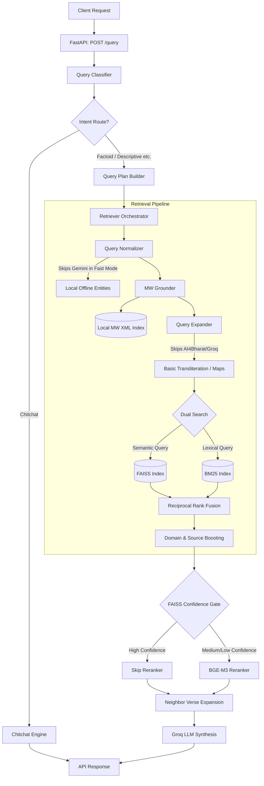

# Bhairav AI

Multilingual retrieval-augmented generation (RAG) over Hindu Dharmic primary sources. Users ask in **Hindi, English, or Hinglish**; the system retrieves grounded passages from indexed texts and synthesizes answers with citations.

**Version:** 2.2.0  
**Stack:** FastAPI · FAISS · BM25 · BGE-M3 reranker · Groq LLM · optional Gemini entity enrichment

---

## Table of contents

1. [What this system does](#what-this-system-does)
2. [Corpus and tiers](#corpus-and-tiers)
3. [Architecture](#architecture)
4. [Query pipeline (nuances)](#query-pipeline-nuances)
5. [Offline vs online dependencies](#offline-vs-online-dependencies)
6. [Repository layout](#repository-layout)
7. [Setup](#setup)
8. [Configuration](#configuration)
9. [Scripts and maintenance](#scripts-and-maintenance)
10. [Evaluation](#evaluation)
11. [External Sanskrit resources](#external-sanskrit-resources)
12. [What not to do](#what-not-to-do)
13. [Roadmap (Sprint 4+)](#roadmap-sprint-4)

---

## What this system does

| Capability | Detail |
|------------|--------|
| **Languages** | Hindi (Devanagari), English, Hinglish (Roman Hindi) |
| **Retrieval** | Hybrid dense (FAISS + Harrier embeddings) + sparse (BM25) fused with RRF |
| **Grounding** | Answers use retrieved `hindi_summary` + Sanskrit `text`; system prompt forbids inventing verses |
| **Intent routing** | Chitchat bypass, factoid/causal/philosophical/narrative/lexical policies |
| **Entity handling** | JSON maps + transliteration ladder + optional APIs (not hardcoded Python dicts) |

---

## Corpus and tiers

Indexed sources (metadata + vectors under `indexes/`):

| Tier | Sources | Role in generation |
|------|---------|-------------------|
| **1 — Vedic** | Rigveda, Atharvaveda, Yajurveda, Samaveda | Labeled `[PRIMARY SOURCE]` in LLM context |
| **2 — Epic / devotional** | Bhagavad Gita, Mahabharata, Valmiki Ramayana, Ramcharitmanas | Labeled `[SECONDARY SOURCE]` |

**Important:** Tier controls **labeling and prompt preference**, not retrieval access. Both tiers reach the reranker and LLM.

---

## System Architecture & Pipeline Flow

Bhairav AI features a high-density, hybrid retrieval-augmented generation pipeline optimized for primary Sanskrit/Dharmic source grounding. The architecture splits query planning, multi-stage transliteration/dictionary expansion, hybrid retrieval, reciprocal rank fusion, confidence gating, and LLM synthesis:



### Component Details & Backend Mechanics

#### 1. Request Handling & Routing Plan
*   **FastAPI Endpoint** (`main.py`): Receives the input query, parses options (e.g. `top_k`, `include_citations`), and triggers the lifespan managers.
*   **Query Classifier & Planner** (`query_classifier.py`, `query_plan.py`): Categorizes the query's intent (e.g., *chitchat, factoid, causal, descriptive, lexical*) using predefined regex and keyword maps (`data/intent_patterns.json`). It builds a `QueryPlan` that adjusts pipeline settings (e.g., `faiss_k`, `bm25_k`, confidence margins, and reranking parameters) according to `data/routing_policies.json`.
*   **Chitchat Engine** (`chitchat.py`): Intercepts short/conversational greetings and executes an immediate short-circuit redirect returning a fixed response from `data/chitchat.json` without spinning up FAISS or loading PyTorch models.

#### 2. Query Normalization & Transliteration Ladder
*   **Query Normalizer** (`query_normalizer.py`): Extracts and translates entities. In fast mode (`FAST_RETRIEVAL=true`), it bypasses the heavy `Gemini` API and relies entirely on a compiled offline dictionary (`data/entity_map_clean.json`).
*   **Monier-Williams Grounder** (`mw_grounding.py`): Maps non-entity Sanskrit terms against a local pre-compiled database of Cologne Monier-Williams lexicon (`indexes/mw_index.json`).
*   **Query Expander & Transliterator** (`query_expander.py`, `transliteration.py`): Resolves Romanized Hindi/Sanskrit (Hinglish) into clean Devanagari. It uses a falling ladder resolution:
    1. Exact or fuzzy match on local `entity_map_clean.json` and `epithet_map.json`.
    2. Transliteration using standard rules (HK / IAST via `indic-transliteration`).
    3. Neural local transliteration (using local `ai4bharat-transliteration` if available and running on WSL/Linux).
    4. HTTP-based fallback APIs (e.g. IndicXlit) if enabled.

#### 3. Dual Query Construction & Hybrid Retrieval
Bhairav AI generates two distinct queries to optimize the strengths of semantic vs. lexical indices:
*   **FAISS Semantic Query**: Constructed from the original query, entity translations, Monier-Williams definitions, transliterations, and **epithets** (e.g., resolving *Partha* to *Arjuna*). It feeds the dense semantic search.
*   **BM25 Lexical Query**: Formulated using the original query and **validated Devanagari tokens only** (Devanagari ratio > 80%). Bypasses the heavy synonym floods to keep the sparse lexical match crisp and avoid keyword pollution.

#### 4. Reciprocal Rank Fusion (RRF) & Source Boosting
*   **Dense Semantic Search**: Queries the FAISS index (` bhairav_faiss.index`) using `microsoft/harrier-oss-v1-0.6b` (1024-dim) embeddings. 
*   **Sparse Lexical Search**: Queries the BM25 index (`bhairav_bm25.pkl`) using rank-based scoring.
*   **RRF Fusion & Source Boost** (`retriever.py`): Merges FAISS and BM25 candidate ranks using the RRF constant (default `RRF_K=60`). Applies a domain boost (e.g. `YAJURVEDA_DOMAIN_BOOST=1.25`) if the query triggers specific source signals found in `data/domain_signals.json`.

#### 5. Adaptive Confidence Rerank Gate
*   **Gating Logic** (`confidence.py`): Checks the top retrieved dense embedding scores.
*   **Skip Reranker**: If the primary FAISS inner product score is high (threshold `RERANK_GATE_SCORE_HIGH=0.85`) and the margin between the first and second matches is substantial (margin `0.20`), the pipeline skips the heavy `BAAI/bge-reranker-v2-m3` cross-encoder step completely to save valuable CPU cycles.
*   **BGE-M3 Reranking**: If confidence is medium/low, the BGE-M3 cross-encoder reranks the top candidates.

#### 6. Flanking Context & Synthesis
*   **Neighbor Verse Expansion** (`retriever.py`): If query confidence is high, the retriever fetches adjacent chunks (±1 in index order) to enrich the context before passing it to the generator. *Note: Adjacent verses are used for generation ONLY and are excluded from core evaluation KPIs to avoid metrics skew.*
*   **Generator** (`generator.py`): Formulates a structured system prompt, injecting retrieved scriptural passages. Primary sources (Tier 1: Vedas) are labeled `[PRIMARY SOURCE]` and secondary sources (Tier 2: Epics/Gita) are labeled `[SECONDARY SOURCE]`. The `Groq` LLM (`llama-3.3-70b-versatile`) synthesizes the grounded answer and returns it with strict, verified inline citations.

---

## Offline vs online dependencies

| Component | Default | Env flag |
|-----------|---------|----------|
| FAISS + BM25 + metadata | Required local `indexes/` | — |
| Entity / epithet maps | `data/*.json` | `REQUIRE_HARVESTED_MAPS` |
| MW index | `indexes/mw_index.json` | build via Cologne XML |
| Wikidata | On | `WIKIDATA_ENABLED=false` for offline |
| Gemini entities | On | `GEMINI_ENTITY_ENABLED`, `GEMINI_API_KEY` |
| IndicXlit API | On | `INDICXLIT_FALLBACK=false` |
| Groq (answers + expand) | Required for `/query` | `GROQ_API_KEY` |
| ai4bharat local xlit | Optional pip package | auto if installed |

**Kaggle / offline eval baseline:**

```bash
set MW_NETWORK_ENABLED=false
set WIKIDATA_ENABLED=false
set INDICXLIT_FALLBACK=false
python -m eval.bhairav_retrieval_eval --stage after_rerank
```

---

## Repository layout

```
main.py                 # FastAPI /query, /health
config.py               # Paths, models, env flags
retriever.py            # Hybrid retrieval orchestration
query_normalizer.py     # Entity enrichment (Gemini, Wikidata, cache)
query_expander.py       # Transliteration + synonyms + domains
entity_resolver.py      # Single loader for entity + epithet JSON
transliteration.py      # Roman → Devanagari ladder
mw_grounding.py         # Non-entity tokens → MW index + BM25 fuzzy
query_classifier.py     # Intent (data/intent_patterns.json)
query_plan.py           # Routing (data/routing_policies.json)
chitchat.py             # Short-circuit (data/chitchat.json)
confidence.py           # FAISS adaptive rerank gate
reranker.py             # BGE-M3 cross-encoder
generator.py            # Groq synthesis + citations
canonical_maps.py       # Scholarly book/parva names
bhairav_data.py         # Load data/*.json and prompts/*.txt

data/
  entity_map_clean.json   # Roman/English → Devanagari (required for full quality)
  epithet_map.json        # Epithet ↔ canonical
  stopwords.json
  domain_signals.json     # RRF source boost triggers
  chitchat.json
  intent_patterns.json
  routing_policies.json
  query_variants.json

prompts/                  # LLM prompts (editable without code deploy)
indexes/                  # FAISS, BM25, metadata (not in git — build separately)
scripts/                  # Maintenance and lexical setup
eval/                     # Retrieval + RAGAS metrics
docs/LEXICAL_RESOURCES.md # Cologne, indic-dict, vidyut, scl notes
```

---

## Setup

### 1. Environment

```bash
python -m venv .venv
.venv\Scripts\activate          # Windows
# source .venv/bin/activate     # Linux/macOS

pip install -r requirements.txt
pip install -r requirements-eval.txt   # optional, for eval/
```

**Do not require `ai4bharat-transliteration` on Windows.** It depends on `fairseq`, which commonly fails to build (`fairseq\version.txt` / PyYAML / pip 24+ issues). Bhairav already transliterates via:

- `data/entity_map_clean.json` + `epithet_map.json`
- `indic-transliteration` (HK/IAST)
- optional HTTP IndicXlit (`INDICXLIT_FALLBACK=true`, off when `FAST_RETRIEVAL=true`)

If you are on **Linux/WSL** and want local neural xlit:

```bash
pip install ai4bharat-transliteration   # may still be finicky; see requirements-optional.txt
set AI4BHARAT_XLIT_ENABLED=true
```

### 2. Secrets (`.env`, never commit)

```env
GROQ_API_KEY=...
GEMINI_API_KEY=...          # optional, entity extraction
DATA_DIR=./data             # optional override
```

### 3. Indexes and maps

Place under `indexes/`:

- `bhairav_faiss.index`
- `bhairav_bm25.pkl`
- `bhairav_metadata.json`
- `bhairav_id_map.json`
- `mw_index.json` (see [Scripts](#scripts-and-maintenance))

Place under `data/`:

- `entity_map_clean.json`
- `epithet_map.json`

See `data/README.md` for map formats.

### 4. Run API

```bash
uvicorn main:app --reload --host 0.0.0.0 --port 8000
```

- Root: `http://127.0.0.1:8000/`
- Docs: `http://127.0.0.1:8000/docs`
- Query: `POST /query` with `{"query": "...", "top_k": 10}`

---

## Performance (if queries take 100+ seconds)

**Retrieval** and **rerank** are separate costs. Check server logs for `1. Retrieval` vs `2. Reranker`.

| Cause | Typical symptom | Fix |
|-------|-----------------|-----|
| **Gemini on every query** | 5–40s in normalize | Fixed: skipped when `offline_first=True`. Set `GEMINI_ENTITY_ENABLED=false` |
| **BM25 full-corpus scan** | 10–60s on large index | Fixed: uses `get_top_n` instead of `get_scores` |
| **Fuzzy synonym over 46k epithets** | 5–20s in expand | Default off: `SYNONYM_FUZZY_ENABLED=false` with `FAST_RETRIEVAL=true` |
| **Groq query expand** | 1–5s network | `GROQ_EXPAND_ENABLED=false` (default in fast mode) |
| **ai4bharat first load** | 30s+ once per process | `AI4BHARAT_XLIT_ENABLED=false` until needed |
| **BGE-M3 reranker on CPU** | 30–90s for step 2 | High FAISS confidence skips rerank; use GPU or ONNX later |

**Fast mode (default):** `FAST_RETRIEVAL=true` disables Gemini, Wikidata, Groq expand, ai4bharat, XLIT API, and heavy fuzzy synonym search.

```bash
set FAST_RETRIEVAL=true
set PROFILE_RETRIEVAL=true
python scripts/profile_retrieval.py "who was arjun"
```

Restart uvicorn after changing `.env`.

---

## Configuration

Key environment variables (see `config.py` for full list):

| Variable | Default | Meaning |
|----------|---------|---------|
| `FAST_RETRIEVAL` | `true` | Disable slow network/fuzzy paths (recommended) |
| `PROFILE_RETRIEVAL` | `false` | Print per-stage timings in retriever |
| `GEMINI_ENTITY_ENABLED` | off if fast | Live Gemini entity extract |
| `GROQ_EXPAND_ENABLED` | off if fast | Groq roman query expansion |
| `AI4BHARAT_XLIT_ENABLED` | off if fast | Local neural transliteration |
| `INTENT_ROUTER_ENABLED` | `true` | Per-intent FAISS/BM25/rerank caps |
| `MW_NETWORK_ENABLED` | `false` | Live Cologne API (use local `mw_index.json`) |
| `WIKIDATA_ENABLED` | `true` | Entity alias enrichment |
| `GEMINI_ENTITY_ENABLED` | `true` | Gemini entity extraction |
| `INDICXLIT_FALLBACK` | `true` | HTTP IndicXlit after local xlit |
| `RERANK_GATE_SCORE_HIGH` | `0.85` | Skip reranker above this FAISS top1 |
| `RERANK_GATE_MARGIN_THR` | `0.20` | Margin top1−top2 for skip |
| `NEIGHBOR_MIN_CONFIDENCE` | `medium` | When to append neighbor verses |
| `YAJURVEDA_DOMAIN_BOOST` | `1.25` | Extra RRF weight for Yajurveda |
| `MAX_SUMMARY_WORDS` | `500` | Metadata sanitization cap |

Editable without code changes: `data/*.json`, `prompts/*.txt`.

---

## Scripts and maintenance

| Script | Purpose |
|--------|---------|
| `scripts/setup_cologne_mw.py` | Build `mw_index.json` from [Cologne MW XML](https://www.sanskrit-lexicon.uni-koeln.de/downloads/) |
| `scripts/sanitize_metadata.py` | Truncate pathological `hindi_summary` (Yajurveda outlier) |
| `scripts/build_entity_graph.py` | `data/entity_graph.json` from maps |
| `scripts/expand_entity_map_from_eval.py` | Add entities from Recall@5 failures |
| `scripts/build_domain_signals.py` | Mine tokens per source into `domain_signals.json` |
| `scripts/verify_embedding_contract.py` | Smoke test query/document embedding alignment |
| `build_mw_index.py` | Low-level MW XML parser (called by setup script) |

```bash
python scripts/setup_cologne_mw.py --xml path/to/mw.xml
python scripts/sanitize_metadata.py --write
python scripts/build_entity_graph.py
python scripts/build_domain_signals.py --write
```

---

## Evaluation

```bash
python -m eval.build_manifest --per-source 500
python -m eval.mine_triplets --max-chunks 2500
python -m eval.bhairav_retrieval_eval --triplets eval/data/triplets.jsonl --stage after_rerank
```

**Primary regression metric:** `after_rerank` (MRR, Recall@5, nDCG@5).  
`after_neighbors` is diagnostic only.

Results written under `eval/results/`.

---

## External Sanskrit resources

| Project | Integration |
|---------|-------------|
| [Cologne Sanskrit Lexicon](https://www.sanskrit-lexicon.uni-koeln.de/) | **Yes** — offline `mw_index.json` |
| [AI4Bharat IndicXlit](https://github.com/AI4Bharat/IndicXlit) | **Yes** — optional pip transliteration |
| [indic-dict](https://github.com/indic-dict) | Documented — batch import to entity maps |
| [vidyut](https://github.com/ambuda-org/vidyut) | Documented — future sandhi/morphology |
| [scl](https://github.com/samsaadhanii/scl) | Documented — research / batch tools |

Details: `docs/LEXICAL_RESOURCES.md`.

---

## What not to do

- Do **not** use neighbor expansion as the main eval KPI path.
- Do **not** rebuild FAISS for embedding model changes without re-validating the no-prefix contract.
- Do **not** run XLIT on full sentences without Devanagari validation (>80% Devanagari ratio).
- Do **not** add hardcoded synonym dicts in Python — use `epithet_map.json` and scripts.
- Do **not** rely on Wikidata/Gemini for core retrieval in offline/eval environments.

---

## Roadmap (Sprint 4+)

- Route-aware prompt family (`prompts/factoid_strict.txt`, etc.)
- SQLite / Redis cache layer for normalization and retrieval
- ONNX BGE reranker for CPU latency
- Corpus expansion (Upanishads, Puranas) with full re-index
- Optional **vidyut** sidecar for classical Sanskrit sandhi

---

## License and data

Private research project. Primary text data and indexes are not redistributed in this repository. Entity maps may include harvested entries — see `data/README.md`.
